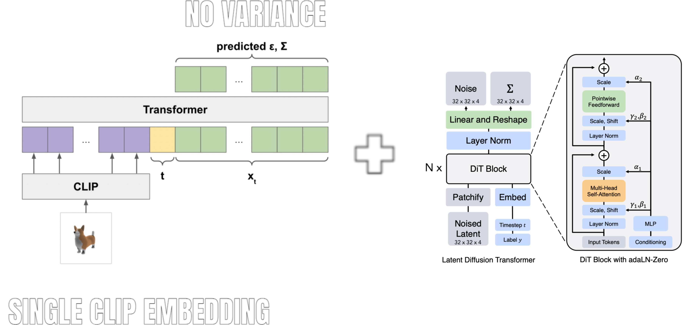

# Tiny 3D Diffusion

A tiny text-to-3d diffusion model based off "Point-E: A System for Generating 3D Point Clouds from Complex Prompts" by OpenAI. The model architecture is modified slightly to include the adaLN-Zero block from "Scalable Diffusion Models with Transformers".

Similar to Point-E, we use CLIP but we take the single text embeddings instead of the last layer embeddings as the conditioning mechansim for the model.

We use a linear noise schedule and we do not predict the variance.



Note: Ok I forgot to initalize the weights of the residual connection to 0 oops.

## Setup

```
poetry init
poetry shell
poetry install
```

## Dataset

We train the model on ModelNet10 and ModelNet40.

To download the dataset first navigate to `scripts`.

```bash
cd scripts
```

To download ModelNet10.

```bash
./download_modelnet10.sh
```

To download ModelNet40.

```bash
./download_modelnet40.sh
```

To process the dataset.

```
python3 process_modelnet.py \
    --rootdir=../data/ModelNet10 \
    --outdir=../data/modelnet10
```

## Training

We trained a small diffusion model on ModelNet10 for 48k steps and a bigger model on ModelNet40 for 200k steps. The weights and model configs can be found in `/weights`.

To train the model run.

```bash
cd scripts

python3 train_text2pointcloud.py \
    --dataset_dir=../data/modelnet40 \
    --subset=all \
    --diffusion_config=../configs/diffusion/dit-base.json \
    --train_config=../configs/train/modelnet40.json \
    --save_dir=../checkpoints/walrus-modelnet40 \
    --num_workers=5 \
    --resume_checkpoint
```

## Demo

Lil web app to visualize diffusion in real-time. Simple React + Python Websocket Server.

1. Download node_modules for the client.

```
cd demo/client && npm i
```

2. Start the Python Server

```
cd demo/server
python3 index.py \
    --weights=../../weights/modelnet40 \
    --port=8080 \
    --num_inference_steps=20 \
    --guidance_scale=2.0 \
    --use_cfg \
```

3. Start the React app

```
cd demo/client
npm run dev
```

## Notebooks

Mostly testing my work on sine and cosine waves here.

## Notes

I wanted to train a super-res model which is conditioned on a low resolution point cloud. Project was going on for too long so did not do it :(.

Learned a lot about diffusion, still a lot of gaps to cover. My first official official diffusion project done!
